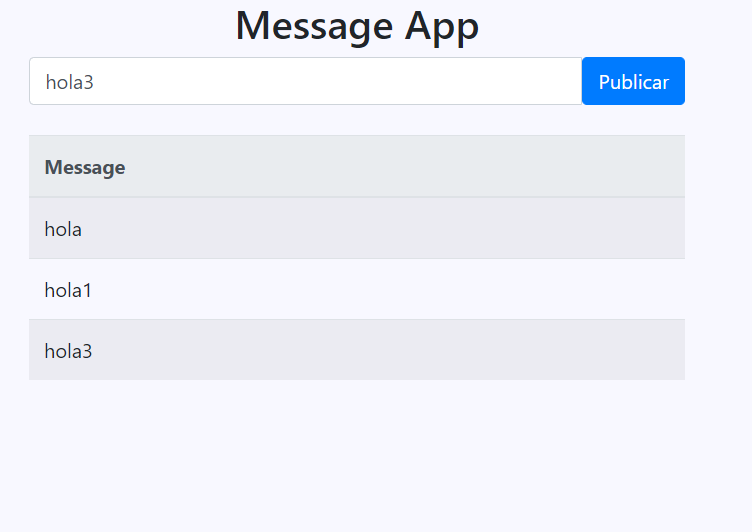
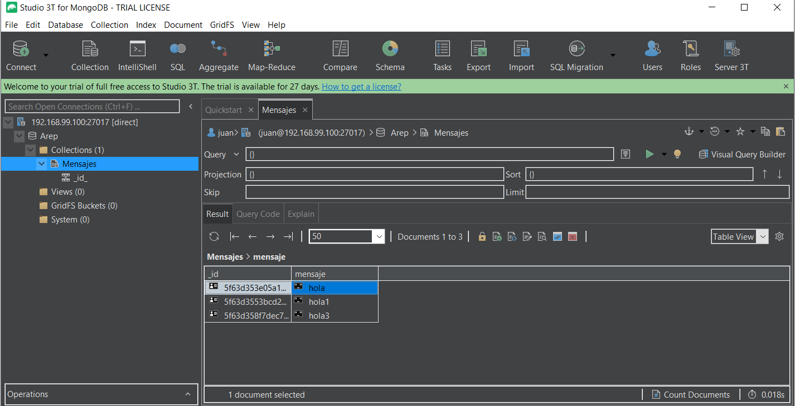

# Docker Aws workshop

In this workshop a system capable of publishing messages will be built. This system is composed of a load balancer component, 3 web logic components and a MongoDB database component, each of which is modularized into Docker containers.


### Prerequisites

* [Docker](https://www.docker.com/) - Container Manager
* [Maven](https://maven.apache.org/) - Dependency Management
* [Java 8](https://www.oracle.com/co/java/technologies/javase/javase-jdk8-downloads.html) -  Development Environment 
* [Git](https://git-scm.com/) - Version Control System
* [Spark](http://sparkjava.com/) - Micro framework for creating web applications in Java 8


## Instrucciones de uso 

1. Clone the repository

```
git clone https://github.com/juancamilo399/AWS_Docker.git
```

2. Compile the projet

```
mvn package 
```

3. Executing the program (you must use the command from the root directory using Docker ToolBox)

```
docker-compose up -d --scale web=3
```

The application can be used from http://192.168.99.100:8088


## Test

Posting messages.




Content of the database.




## Built With

* [Maven](https://maven.apache.org/) - Dependency Management
* [Spark](http://sparkjava.com/) - Micro framework for creating web applications in Java 8

## Documentation

View [Documentation](https://juancamilo399.github.io/AWS_Docker/apidocs_load/)

View [Documentation](https://juancamilo399.github.io/AWS_Docker/apidocs_web/)

## Inform

The architecture document can be found [here](arep5.pdf)


## Author

* **Juan Camilo Angel Hernandez** 


## License

This project is under GNU General Public License - see the [LICENSE](LICENSE) file for details.
